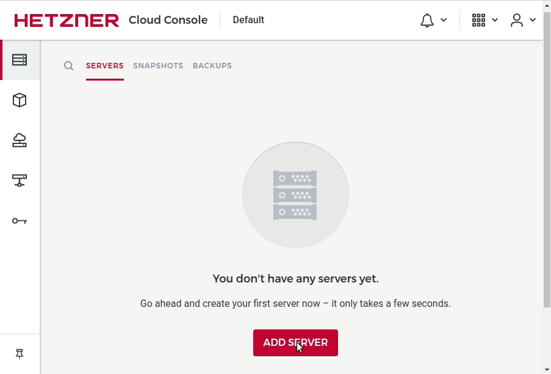

Buying nodes
============

- I recommend Ubuntu (LTS) as a node OS. On other Linux distros some packages might be missing.
- The `private` network we created makes intercommunication of nodes of the cluster secure. Otherwise, a VPN must be manually set up.
- Using SSH key is the most secure way of getting access to a node.

Following the same procedure we need to create at least two worker nodes in `private` network.

Initial node setup
=============

- timezone
- route?
- etcd
- docker
- kubernetes